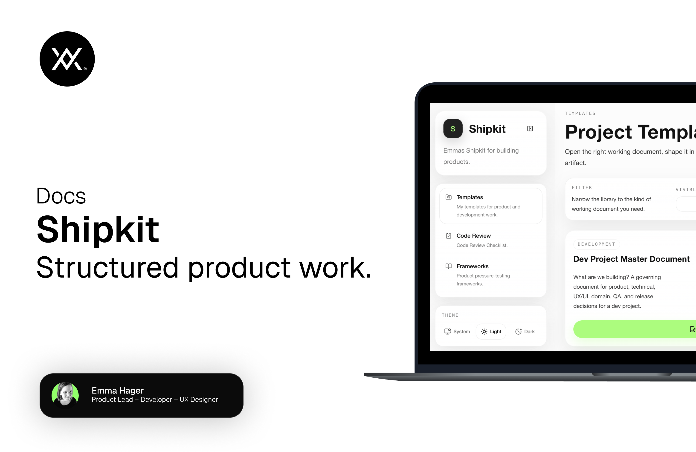

# Shipkit

Shipkit is a document workspace for shaping project templates, code reviews, frameworks, and vibe-coding workflows into editable, exportable project documents.

## Table of Contents

- [About](#about)
- [Features](#features)
- [Tech Stack](#tech-stack)
- [Contributing](#contributing)
- [Changelog](#changelog)
- [License](#license)

## About

Shipkit is a React-based internal tool for opening structured project documents in the browser, editing them directly in-app, and exporting them as clean Markdown or PDF. It is designed to support real working flows around project definition, code review, reusable frameworks, and AI-assisted build workflows without forcing users into external editors.

## Features

- Templates workspace — Edit project templates like Dev Project Master Document, Dev Pipeline Master Document, Requirements Specification, Roadmap, Build Plan, and README directly in the app.
- Code Review workspace — Run structured checklist-based reviews with editable findings and exportable review documents.
- Frameworks workspace — Open reusable reference frameworks and prompts as editable working documents.
- Vibe Coding workspace — Guide a project from Deep Research to PRD, Tech Design, and Codex setup with exportable step artifacts.
- Live preview and export — Preview documents in-app and export them as Markdown or PDF.
- Floating panels — Detach, resize, lock, and rearrange panels for different working styles.
- Local draft persistence — Keep local in-browser drafts while iterating on documents.
- Light and dark theme support — Supports light, dark, and system theme behavior.

## Tech Stack

| Layer       | Technology |
|-------------|------------|
| Frontend    | React 18 + TypeScript |
| Routing     | React Router |
| Build Tool  | Vite |
| Styling     | Tailwind CSS v4 + custom CSS |
| Icons       | Lucide React |
| Backend     | None |
| Database    | None |
| Persistence | Browser localStorage |
| Hosting     | Static hosting / Vercel-compatible |

## Contributing

This project is currently structured as a focused internal product workspace. If you contribute to it, keep changes scoped, preserve the existing document workflow logic, and verify the app with:

```bash
npm run build
```

## Changelog

There is no separate `CHANGELOG.md` file yet. Version changes are currently tracked directly in the project and git history.

## License

This project and its contents are copyrighted and proprietary. No use, reproduction, distribution, or modification is permitted without explicit written permission.

---

© 2026 [WOWEN](https://wowen.se). All rights reserved.
